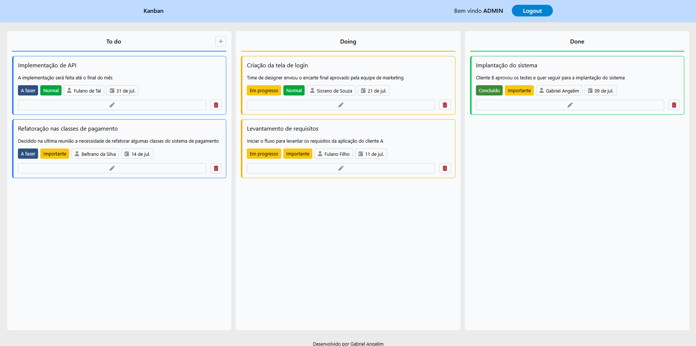
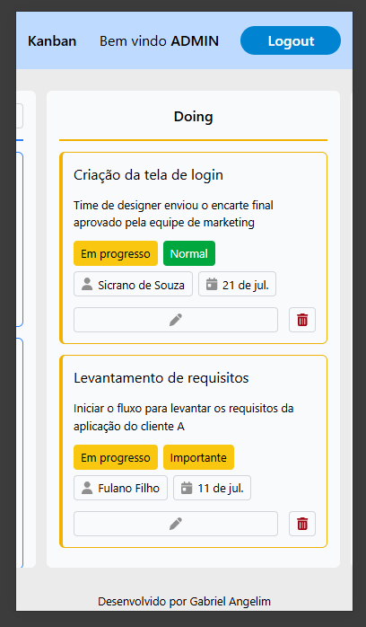

# 🔖 Kanban WEB

Sistema simples de gerenciamento de tarefas baseado no método Kanban, desenvolvido com React.

## ✅ Funcionalidades

- Criar novas tarefas (To Do)
- Editar tarefas existentes (título, descrição, data, responsável, prioridade, categoria e status)
- Mover tarefas entre etapas (To Do → Doing → Done)
- Excluir tarefas
- Sistema de login fictício (apenas para fins de teste e aprendizado)

## 🛠️ Tecnologias e bibliotecas utilizadas

- **React** – Front-end componentizado, ideal para projetos rápidos e escaláveis
- **React Hook Form** – Criação e validação de formulários
- **Yup** – Validação de dados de forma estruturada
- **Tailwind CSS** – Estilização rápida com classes utilitárias
- **Font Awesome** – Ícones modernos e de fácil uso

## 💻 Instalação

1. Clone o diretorio `git clone https://github.com/AngelimGabriel/project-kanban`
2. Instale as dependencias `npm install`
3. Rode o projeto `npm run dev`

## Prints do projeto

- Desktop
  

- Mobile
  
